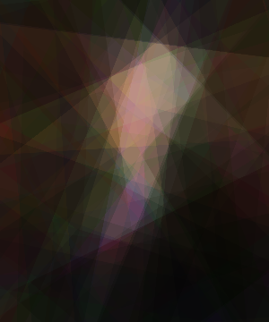
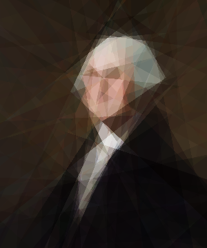
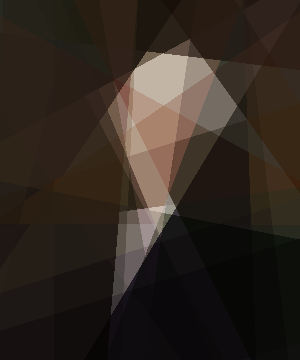
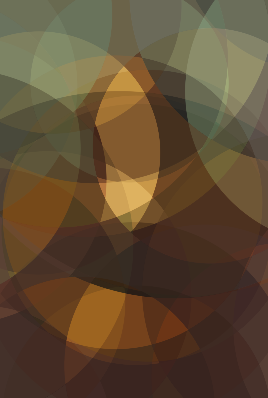
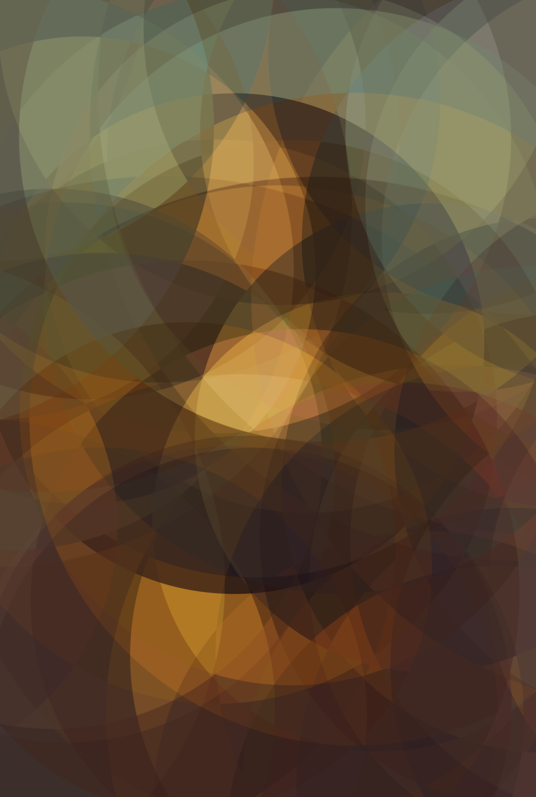
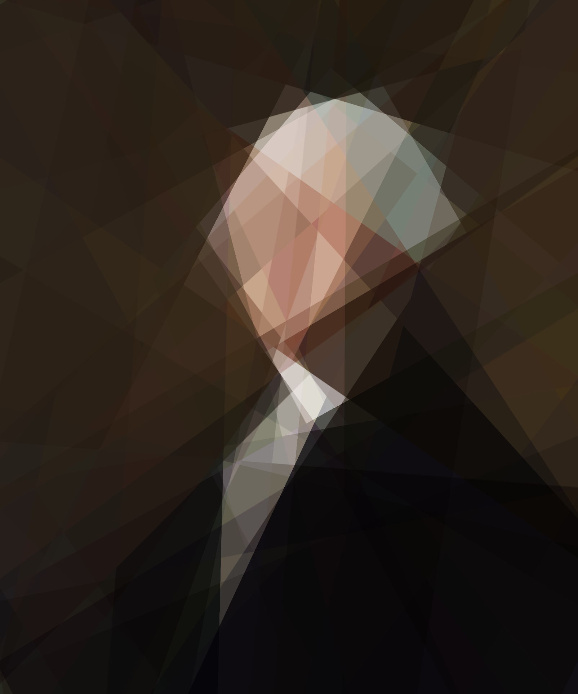

# scalefree_image

How can you best approximate an image if you're constrained to partitioning it with N arbitrarily placed lines and coloring every pixel in each partition the same color?  What about N circles?

We train a neural network whose first layer's represententation cannot distinguish between pixel locations inside the same region.  Computing the color from this information, i.e. the task of the rest of the network, will therefore color all pixels in the same region the same color.

Each line unit will indicate which side the input (x, y) is on with a +1 or a -1 output.  Each circle unit will indicate whether the input is inside or outside the circle, again with -1 or +1 respectively.

The full network architecture (3 trainable layers) is:
 * **Inputs (2)**: (x,y) coordinates of pixel, normalized to -1 to +1.
 * **"Divider" unit layer (N)**: N line or circle units, each outputting -1 to +1 depending on which side of the line or whether inside/outside the circle.
 * **Color choosing layer (M)**: M ReLu units, each taking a weighted sum of the divider unit representation.
* **Output layer (3)**: r,g,b values, each between 0 and 1, sigmoid activations.

Training on the famous portrait of George Washington by Gilbert Stuart, with N=128 lines and M=32 color units, produces this approximation after the first 5 epochs and 500 epochs of training:
   

### Overview - line units

Lines are parameterized by center point $(C_x, C_y)$ and angle $\theta$.  The error  derivative is computed with respect to these parameters, in that form.

The Excitation of line unit $j$ with centers $C_j$ and angles $\theta_j$ given input $X_i = (x_i,y_i)$ is defined 

$$
E_j(X_i)\frac{(X_i - C_j) \cdot \begin{pmatrix} \cos(\theta_j) \\ \sin(\theta_j) \end{pmatrix}}{||X_i - C_j||}
$$

I.e., cosine for the angle between the vector from center to input and the line.

The Activation of unit $j$ is:

$$
A_j(X_i) = \tanh(E_j(X_i) * \text{sharpness})
$$

Where $\text{sharpness} = 1000.0$ is generally used to make the color boundaries very sharp.  This means almost all inputs are either very close to -1 or +1.  To prevent the flat graidents from keeping the lines still during training, we use a false gradient, the derivative with a much smaller sharpness.  The default vaule for this parameter, `grad_sharpness`, is 5.0.

### Overview - circle units
Circles are parameterized by center point $(C_x, C_y)$ and radius $r$. Radius parameters are stored/updated as $log(r)$ so $r$ stays nonnegative.  Centers are stored  the same as with lines, i.e. naturally.

The Excitation of circle unit $j$ with centers $C_j$ and radius $R_j$ given input $X_i = (x_i,y_i)$ is defined

$$
E_j(X_i) = \frac{||X_i - C_j|| - R_j}{R_j}
$$

I.e. how many radii away the input is from the edge of the circle, negative if inside the circle, down to -1 if at the center, and positive if outside the circle, going to infinity as you go further away.
The Activation of unit $j$ is the same as for lines:

$$
A_j(X_i) = \tanh(E_j(X_i) * \text{sharpness})
$$

(With a lower gradient sharpness for the false gradient, as with lines.)

### Overview - Color units.

The number of partitions N lines can create is at most N(N-1)/2 + N + 1.  Ultimately, the size of the color choosing layer should take this into account, as well as the complexity and diversity of colors in the target image, but there is no automated way to predict this yet.

#### Why this is "scale free"

We are training to learn f(x,y) = (r,g,b) for all pixels of an image.

This is the "scale free" representation of the image, a function describing the color at any real-valued (x,y) coordinate. You can then create a new image from this representation at any resolution,  or zoom out to see how the representation extrapolates.


# The Application

Run 'python image_learn.py --help' to see all options:
```
usage: image_learn.py [-h] [-d N_DIVIDERS] [-n N_HIDDEN] [-t TYPE] [-i INPUT_IMAGE] [-e EPOCHS]
 [-x DISP_MULT] [-m MODEL_FILE] [-j] [-b BORDER] [-p DOWNSCALE] [-l LEARNING_RATE] [-s SHARPNESS]
  [-g GRADIENT_SHARPNESS] [-f SAVE_FRAMES] [-c CYCLES]

Learn an image, watch progress, generate frames to animate.

options:

  -h, --help            show this help message and exit
  -i INPUT_IMAGE, --input_image INPUT_IMAGE
                        image to transform (default: None)
  -t TYPE, --type TYPE  Type of division unit ('circular' or 'linear' or 'relu'). (default: linear)
  -d N_DIVIDERS, --n_dividers N_DIVIDERS
                        Number of divisions (linear or circular) to use. (default: 1)
  -n N_HIDDEN, --n_hidden N_HIDDEN
                        Number of hidden_units units in the model. (default: 64)
  -m MODEL_FILE, --model_file MODEL_FILE
                        model to load & continue. (default: None)
  -j, --just_image      Just do an image, no training. (default: False)
  -e EPOCHS_PER_CYCLE, --epochs_per_cycle EPOCHS_PER_CYCLE
                        Number of epochs between frames. (default: 1)
  -c CYCLES, --cycles CYCLES
                        Number of training cycles to do (epochs_per_cycle epochs each). 0 = run forever. (default: 0)
  -x DISP_MULT, --disp_mult DISP_MULT
                        Display image dimension multiplier (X training image size). (default: 1.0)
  -b BORDER, --border BORDER
                        Extrapolate outward from the original shape by this factor. (default: 0.0)
  -p DOWNSCALE, --downscale DOWNSCALE
                        downscale image by this factor, speeds up training at the cost of detail. (default: 1.0)
  -l LEARNING_RATE, --learning_rate LEARNING_RATE
                        Learning rate for the optimizer. (default: 0.01)
  -s SHARPNESS, --sharpness SHARPNESS
                        Sharpness constant for activation function, activation(excitation) = tanh(excitation*sharpness). (default: 1000.0)
  -g GRADIENT_SHARPNESS, --gradient_sharpness GRADIENT_SHARPNESS
                        Use false gradient with this sharpness (tanh(grad_sharp * cos_theta)) instead of actual (very flat) gradient. High values result in divider units not moving very much, too low and they don't settle. (default: 5.0)
  -f SAVE_FRAMES, --save_frames SAVE_FRAMES
                        Save frames during training to this directory (must exist). (default: None)
```
Important arguments:
  * **input_image**: image to learn / approximate
* **n_dividers**: number of line or circle units to use, i.e. first layer size
* **n_hidden**: number of ReLu units in the color choosing layer, second layer size
* **type**: 'linear' for line units, 'circular' for circle units
* **epochs_per_cycle**: number of epochs to run between display updates (regenerating the image output)
* **cycles**: number of training cycles to do (epochs_per_cycle epochs each). 0 = run forever.
* **downscale**: downscale image by this factor for training, speeds up training, very useful especially with small networks.
* **save_frames**: save frames during training to this directory (must exist).  Useful for making an animation of the training process.

Running to generate an image from a trained model:
* **just_image**: just generate the image from a saved model (using param `-m` or `--model_file` with the model `.pkl` file)
* **disp_mult**:  Generate a high resolution image by using a large value here (it is multiples of the downscaled training image size).

## Videos
run `> python make_movie.py --help` to see options for making movies from saved frames.

Click the image for a link to a video showing the process with different numbers of linear dividers.  How many does it take for you to recognize the image?

[](https://youtube.com/shorts/in2lN46T8gw?feature=share)

Click this image to see the same for circular dividers.

[](https://youtube.com/shorts/e53WyUZP48k)


####  Gallery

Rose, approximated with 100 lines and 100 circles:


Line approximation, zoomed out, high res (`-b 3 -x 4`).


Circle approximation, zoomed out, high res (`-b 3 -x 4`).


High-res output of famous portraits (64 circle/line units, 20 color units).  Trained models can output an image of any size:



#### Usage

`image_learn.py` saves the model after each set of epochs, to a .tf file, which includes the input image and all the training parameters.

You can resume training by loading a model with the `-m model.tf` option, and override the parameters contained therein with the other command-line options.

Run `python image_learn.py` to see all options.

NOTE:  Hit ESCAPE from the display window to shut down cleanly.  Program will exit after finishing the current epoch and saving the model.  Do NOT just close the window.  This is a VisPy bug where the close callback doesn't get called if the window is closed this way.

